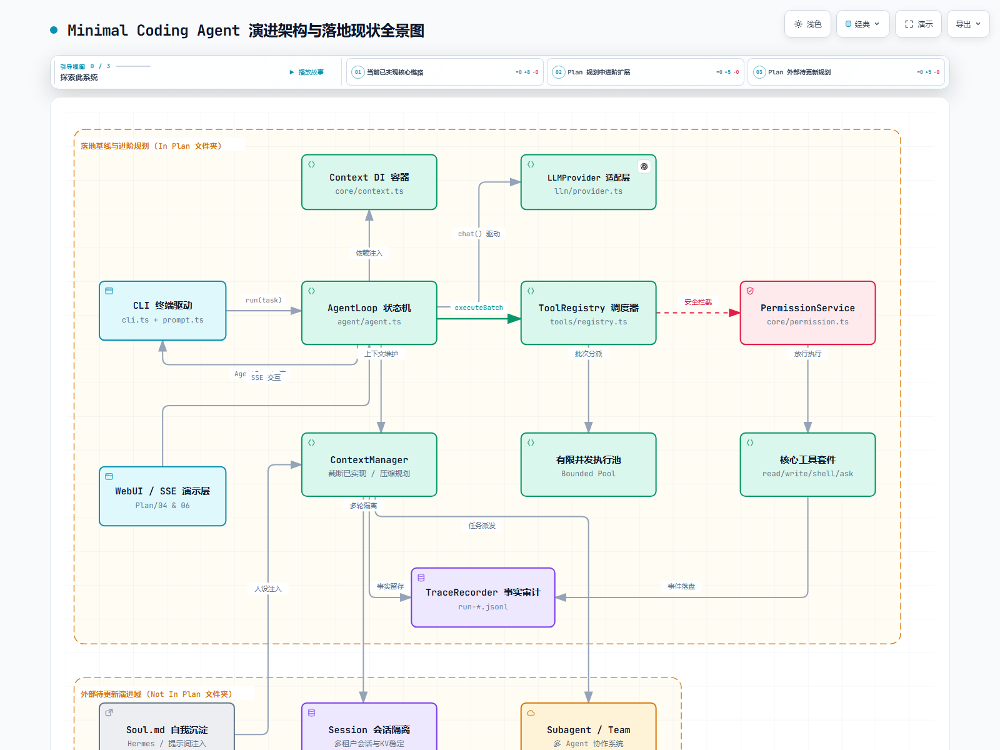

# Minimal Coding Agent

DSH-inspired **Minimal Agent Runtime**（不是 Mini DeepSeek Harness）——提取 DSH 的核心工程思想（Context / Registry / Agent Loop），压缩到生产级极简规模的多轮 Tool Calling Coding Agent。


> 💡 交互式架构图网页可直接在浏览器打开：[`docs/architecture.html`](docs/architecture.html)（支持深/浅色主题、矢量缩放、视角过滤、聚焦高亮与拓扑连线）。

---

## 架构演进与落地边界

系统严格遵循 **控制策略与环境能力解耦** 的工程原则，将能力划分为三大明确的生命周期状态：

| 状态分类 | 包含模块 / 规约位置 | 落地现状说明 |
| :--- | :--- | :--- |
| **● 已实现 (Implemented Baseline)** | **AgentLoop** (`agent/agent.ts`)<br>**Context DI** (`core/context.ts`)<br>**LLMProvider** (`llm/provider.ts`)<br>**ToolRegistry** (`tools/registry.ts`)<br>**PermissionService** (`core/permission.ts`)<br>**4项工具** (`read`/`write`/`shell`/`ask`)<br>**TraceRecorder** (`core/trace.ts`)<br>**Tool Result 截断** (`core/context-manager.ts`) | **完整交付并闭环**：<br>• Thought → Action → Observation 状态跃迁与 maxSteps 兜底<br>• 极简 DI 依赖注入与路径牢笼安全校验（防 `../` 逃逸）<br>• 危险命令审批（[y/N] 拦截卡点与 fail-closed 保护）<br>• 批调度（连续 parallelSafe 工具分组并发与按序提交）<br>• 原始全量事件旁路落盘（`run-*.jsonl`）与超长结果截断（保留头70%+尾30%） |
| **○ 规划中 (In Plan 文件夹)** | **WebUI / SSE 演示层** (`Plan/04` & `Plan/06`)<br>**历史压缩与 Token 预算** (`Plan/07`)<br>**有限并发执行池** (`Plan/07`) | **设计规约已就绪**：<br>• 前端 React + Tailwind Mock 脚手架已就绪，通过 SSE 广播契约事件<br>• `ContextManager.compact()` 消息对成对压缩机制<br>• Bounded Concurrency Pool 信号量控制（如并发数 ≤ 4） |
| **⚠ 待更新 (Not in Plan 文件夹)** | **Soul.md 自我沉淀** (Hermes 提示词注入)<br>**Context Memory / KV 稳定**<br>**Session 会话隔离**<br>**Subagent / Team 协作系统** | **非 Plan 探索方向**：<br>• 尚未在项目 `Plan/` 文件夹中建立 SPEC 与验收标准的外部探索特性 |

---

## 核心架构拓扑

```text
                               ┌─────────────────┐
                               │  Context DI 容器 │ (已实现)
                               └────────┬────────┘
                                        │ 依赖注入
                               ┌────────▼────────┐    chat() 协议    ┌──────────────────┐
  CLI 终端驱动  ───────────────►│    AgentLoop    ├─────────────────►│ LLMProvider 适配 │ (已实现)
  (已实现)         run(task)    │   状态机引擎    │                  └──────────────────┘
                               └────────┬────────┘
  WebUI 演示层  ···············►         │
  (规划中 Plan)    SSE 交互              ├───────────────────────────────┐
                                        │ executeBatch (批处理)         │ 上下文截断 / 维护
                               ┌────────▼────────┐             ┌────────▼────────┐
                               │  ToolRegistry   │             │ ContextManager  │ (截断已实现 /
                               │   能力调度器    │ (已实现)     │ 上下文管理器    │  压缩规划中)
                               └───┬─────────┬───┘             └───┬─────────┬───┘
                                   │         │ 批次分派            │         │
                 安全拦截          │         │ (规划中 Plan)       │         │ 多轮隔离
       ┌───────────────────────────┘         │                     │         ▼ (待更新 非Plan)
       ▼                                     ▼                     │  ┌──────────────────┐
┌──────────────┐ 放行执行 ┌──────────────┐ ┌──────────────┐       │  │ Session 会话隔离 │
│  Permission  ├─────────►│  核心4项工具 │ │ 有限并发池   │       │  └──────────────────┘
│  安全审批    │          │ read/write/  │ │ Bounded Pool │       │
│  (已实现)    │          │ shell/ask    │ └──────────────┘       │  ┌──────────────────┐
└──────────────┘          └──────┬───────┘                        ├─►│ Subagent / Team  │ (待更新 非Plan)
                                 │ 事件落盘                       │  └──────────────────┘
                                 ▼                                │
                        ┌──────────────────┐ 完整事实留存         │  ┌──────────────────┐
                        │  TraceRecorder   │◄─────────────────────┘  │ Soul.md 人设沉淀 │ (待更新 非Plan)
                        │  run-*.jsonl 事实│ (已实现)                └─────────┬────────┘
                        └──────────────────┘                                   │ 提示词反思注入
                                                                               └────────────────► (待更新)
```

角色划分：

| 组件 | 职责 |
| --- | --- |
| `AgentLoop` | 控制策略（模型调用 + 状态推进），带 `maxSteps` 兜底 |
| `Context` | Runtime 依赖容器（极简 DI，约定注入键 `"llm"` / `"tools"` / `"permission"`） |
| `ToolRegistry` | Tool 能力注册、查找、导出 LLM schema、批调度与统一执行入口 |
| `Tool` | Agent 与环境之间的 Action（zod 入参 schema + `execute`） |
| `PermissionService` | 安全防护卡点（safe 免批放行 vs dangerous 人类审批） |
| `ContextManager` | 上下文截断保护（Trace 保留完整事实，Context 智能截断保留关键头尾） |
| `TraceRecorder` | 事实可观测性（每轮 Run 全量异步写入 `run-*.jsonl` 供回溯审计） |

## 安装与配置

```bash
npm install
cp .env.example .env   # 填入你的 API Key
```

`.env` 配置项：

```dotenv
OPENAI_API_KEY=     # 必填
OPENAI_BASE_URL=    # OpenAI-compatible 端点，可选
OPENAI_MODEL=       # 模型名
```

支持任何 OpenAI-compatible 端点（`/v1/chat/completions` + function calling）。

## 运行

```bash
npm run build
npm start -- --workspace ./examples/demo --max-steps 20 "你的任务"
# 不带任务参数则进入交互模式，逐条输入任务
```

### WebUI（本地演示）

```bash
npm run build
npm run web          # 启动后端（默认 http://127.0.0.1:8046，可用 WEB_PORT 覆盖）
# 浏览器打开 http://127.0.0.1:8046 ，右上角 Source 切到 "Live API" 即接真实 Runtime
```

- 前端 `web/` 与 Runtime 只通过 `AgentEvent` / `AgentReply` 契约（doc 04 A.3）+ HTTP 通信，不 import `src/` 内部实现。
- 传输：`GET /api/run?task=...`（SSE 下推契约事件）+ `POST /api/reply`（ask 应答上行）；单会话内存态，新 run 覆盖旧 run。
- ask_user（输入框作答）与 Permission（Approve/Reject 按钮）在网页上暂停-恢复 Agent，与 CLI readline 是同一交互层的两种实现。
- ⚠️ **本地 only**：服务无鉴权，仅监听 127.0.0.1，**勿暴露公网**。workspace 可经 `?workspace=` 指定（必须存在），文件工具的越权校验不放宽。

- `--workspace <dir>`：Agent 工作根目录，默认 `process.cwd()`。所有文件工具被约束在该目录内，逃逸路径直接拒绝。
- `--max-steps <n>`：Agent Loop 步数上限，默认 20，达到上限返回明确提示而非死循环。
- 运行时打印每轮 tool 调用（名称 + 参数摘要）、tool 结果摘要、最终答案。
- 每次启动自动在 `traces/run-<时间戳>.jsonl` 记录全量事件 Trace：任务、每步完整 LLM 请求（messages）/响应、每次 tool 调用与结果——可用于运行后审计与回放（`traces/` 已 gitignore）。
- shell 工具输出自适应解码：严格 UTF-8 探测失败时回退 GBK（中文 Windows cmd），避免 `dir` 等命令中文乱码。

## 工具

| 工具 | 入参 | risk | parallelSafe | 行为 |
| --- | --- | --- | --- | --- |
| `read_file` | `{ path }` | safe | true | 读取 workspace 内文件，返回文本内容 |
| `write_file` | `{ path, content }` | dangerous | false | 写入/覆盖 workspace 内文件，自动建父目录 |
| `shell` | `{ command }` | dangerous | false | 在 workspace 下执行命令，返回 `exit` + `stdout` + `stderr`（60s 超时） |
| `ask_user` | `{ question }` | safe | false | 暂停 Agent，向人类提问，答案作为 ToolResult 回灌后恢复 |

错误一律以结构化文本回灌模型（`ToolResult{ ok:false }`）而非中断，让 Loop 有自我纠正机会。

## 阶段二能力扩展

三个能力都挂在 **Context / Registry** 扩展点上，Agent Loop 核心保持简单。

### Permission Control（Feature A）

- `Tool` 新增 `risk: "safe" | "dangerous"`；危险工具执行前必须经 `PermissionService.check()` 批准。
- 调用链：`Agent → Registry.execute → PermissionService.check → Tool.execute`——permission 逻辑集中在 Registry 一处。
- CLI 实现：`Approve <tool> <参数摘要> [y/N]:`（仅 `y`/`yes` 放行）；EOF / 读入失败一律视为拒绝（**fail-closed**）。
- 未注册 permission 服务时，危险工具直接拒绝。
- 拒绝时模型收到 `denied by user`，可合理收尾而不是崩溃重试。
- 已验证：`n` → 命令不执行、模型报告被拒；`y` → 正常执行；`read_file`（safe）不触发提示。

### ask_user（Feature B）

- `LLM → ask_user → Agent 暂停 → CLI 输入 → Tool Result → Agent 恢复`，证明 Loop 支持 `LLM → Environment → Human → Agent` 闭环。
- 与 Permission 复用同一个共享 readline 封装（`src/cli/prompt.ts`，内部带行缓冲队列，管道/交互两种输入模式均不丢行）。
- 已验证：信息不足时模型主动调用 `ask_user`，人类输入的文件名被采纳并实际创建文件。

### Parallel Tool Calling（Feature C）

- `Tool` 新增 `parallelSafe: boolean`；Registry 新增 `executeBatch(calls, ctx)`：
  连续的 parallelSafe 工具分组 `Promise.all` 并行，其余逐个 `await`；结果严格按原 call 顺序回灌。
- 不做复杂 Scheduler；Permission 逐个检查（危险工具本就非 parallelSafe）。
- 运行时日志会打印批次信息，如 `[step 1] batch of 3 (parallel x3)`。
- 单元测试用耗时探针证明并发真实发生（3×120ms 批次耗时 ≪ 360ms 顺序基线）。

## 验证过的功能 Case

### Case 1 — 总结文件

```text
输入：Read README.md and summarize this project.
链路：read_file → LLM → final answer
结果：终端出现 read_file 调用记录，最终输出为 README 的自然语言总结。
```

### Case 2 — 创建并运行代码

```text
输入：Create hello.py that prints Hello Coding Agent, then run it and tell me the result.
链路：write_file → shell(python3 hello.py) → final answer
结果：workspace 下出现 hello.py，shell 输出 "Hello Coding Agent"，最终答复转述运行结果。
```

## 测试与验证

### 测试分层（`npm test`，47/47 通过，vitest）

| 层级 | 对象 | 需要真实模型 | 位置 |
| --- | --- | --- | --- |
| 静态检查 | `npm run typecheck`（src + tests 双 tsconfig） | 否 | — |
| 单元测试 | Tool / Registry / 路径约束 / LLM 响应解析（mock SDK） | 否 | `tests/tools` / `registry` / `provider` |
| 集成测试 | Agent Loop（ScriptedLLM Mock，经 Context 注入，不触网） | 否 | `tests/agent` / `permission` / `ask-user` / `parallel` |
| E2E 冒烟 | CLI + 真实端点（`node scripts/e2e-smoke.mjs`） | 是 | `docs/e2e-smoke-log.md` 留档 |

| 文件 | 覆盖 |
| --- | --- |
| `tests/registry.test.ts` | register 重名报错 / get / list / toLLMSchema 结构 / execute 四类失败回灌不抛出 |
| `tests/tools.test.ts` | read/write 往返、自动建父目录、路径越权（相对/绝对）被拒、shell 退出码与 stdout/stderr 捕获、cwd、GBK/UTF-8 自适应解码 |
| `tests/agent.test.ts` | Mock LLM（经 Context 注入 `"llm"`）驱动多轮闭环：tool_calls → 执行 → 回灌 → final；maxSteps 兜底；错误回灌不中断 |
| `tests/permission.test.ts` | 无 permission 服务 fail-closed、拒绝时工具未执行、批准执行、safe 工具零检查、CLI y/yes 语义、EOF 视为拒绝 |
| `tests/ask-user.test.ts` | 人类输入回灌、接口形状（safe/非并行）、zod 失败、EOF 不崩溃 |
| `tests/parallel.test.ts` | 并发探针证明真实并行、混合批次顺序语义、真实工具 parallelSafe 标记、批次中失败不阻塞、batchStats 分组 |
| `tests/provider.test.ts` | `tool_calls` / `final` 两态解析、null content 兜底、无 choices 报错、tools/tool_choice 请求透传、apiKey/baseUrl 构造透传（`vi.mock("openai")` 不触网） |

### E2E 冒烟（真实端点）

```bash
npm run build
node scripts/e2e-smoke.mjs --out docs/e2e-smoke-log.md
```

覆盖 Case 1（总结文件）、Case 2（建 hello.py → 运行 → 汇报，含 Permission 批准输入）、Parallel（三文件并行读取）。
最近一次运行 7/7 PASS，完整日志见 [`docs/e2e-smoke-log.md`](docs/e2e-smoke-log.md)。

### 安全说明

- 仓库不含真实密钥（`git grep "sk-"` 自检通过；真实 key 只在本地 `.env`，已被 `.gitignore` 忽略并验证 `git check-ignore`）。
- **shell 工具风险与缓解**：`shell` 以 workspace 为 `cwd` 执行任意命令（60s 超时、1MB×输出截断、`windowsHide`），但**没有命令白名单**——模型可请求任何命令。缓解措施：`risk: "dangerous"` 强制人类批准（fail-closed，EOF/无服务一律拒绝）、全量 JSONL Trace 事后审计、拒绝结果回灌模型促使其收敛。**此工具仍应只在受信任的本地环境使用**。
- 文件工具被路径约束限制在 workspace 内（相对/绝对路径逃逸均被拒），但 `shell` 内部命令（如 `cat ../x`）不受该约束——这是当前已知边界。

### 遗留假设与未验证项

- 并行仅覆盖"连续 parallelSafe 分组"策略；未验证极端并发（如 100+ 文件同时读取）下的 fd/内存行为。
- shell 60s 超时逻辑未写自动化测试（等待成本高），超时路径由 `exec` 内置 `timeout` 保证，属未实测的信任项。
- `tests/provider.test.ts` 通过 mock SDK 验证请求/解析形状，真实 SDK 版本升级（openai ^5）时形状断言需复查。
- 端点兼容性假设：目标端点支持 OpenAI `tools`/`tool_calls` 并要求回灌消息带 `type:"function"`（已在代码中处理）；其他兼容端点未测试。
- 管道输入（非 TTY）下批准/ask_user 依赖行缓冲队列，交互 TTY 场景由人工演示验证过，自动化测试未覆盖 TTY 行为。

## 技术故事

这个项目按"小而完整的 Phase"推进：Phase 1 冻结架构交付最小 Runtime（Context / Registry / Agent Loop + 三工具），Phase 2 在不改动 Loop 核心的前提下通过扩展点挂载 Permission / ask_user / Parallel，Phase 3 收敛为质量门禁与交付。

- **不做**插件系统、生命周期、Context Policy、多 Agent、RAG —— 保持最小正确规模。
- **错误回灌而非中断**：工具失败以文本回灌模型，Loop 有自我纠正机会（已验证 ENOENT 场景）。
- **Registry 是能力扩展点**：permission、parallel tool 挂在此处，不改 Agent Loop。
- **消息闭环**：遵循 OpenAI function calling 规范（`assistant.tool_calls` 带 `type:"function"` + `role:"tool"` + `tool_call_id` 原样带回）。

## 目录结构

```text
src/
├── index.ts              # 入口：解析参数 → 组装 Context → 跑 Agent → Trace
├── agent/
│   ├── agent.ts          # Agent Loop
│   └── types.ts          # Tool / ToolResult / Message / LLMResponse
├── core/
│   ├── context.ts        # 极简 DI 容器
│   ├── permission.ts     # PermissionService（接口 + CLI 实现 + fail-closed）
│   └── trace.ts          # JSONL 运行 Trace（旁路记录，可审计回放）
├── llm/
│   └── provider.ts       # OpenAI-compatible 封装 + 响应解析
├── tools/
│   ├── registry.ts       # 注册 / 查找 / LLM schema / 权限串接 / 批量并行执行
│   ├── read-file.ts
│   ├── write-file.ts
│   ├── shell.ts
│   └── ask-user.ts       # Human-in-the-loop 提问工具
└── cli/
    ├── cli.ts            # 参数解析 + 事件渲染
    └── prompt.ts         # 共享 readline 封装（行缓冲队列）
tests/                    # vitest 单元 + 集成（Mock LLM 不触网）
scripts/                  # robustness-check / e2e-smoke
docs/                     # E2E 冒烟运行日志
```
